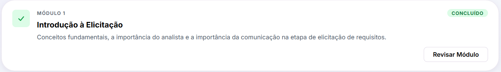
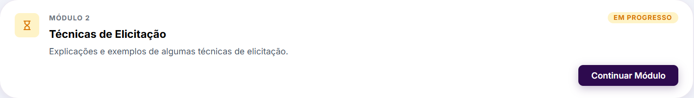
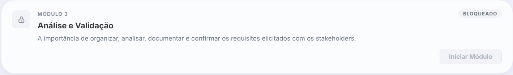

# 4.1.2. Reutilização de Estilos e Layout (Design System)

## 1. Introdução

No desenvolvimento de interfaces modernas, a reutilização não se limita apenas a componentes de código (como classes, funções, etc). Ela também se aplica às **decisões de design** (como cores, espaçamentos, tipografia, sombras e raios de borda).

Para evitar a duplicação de estilos e garantir a consistência visual em todo o projeto **ConhecendoRequisitos**, adotamos o conceito de **Design Tokens** (Salesforce, 2017). Centralizados no arquivo [tokens.css](https://github.com/UnBArqDsw2026-1-Turma01/2026.1-T01-G02_ConhecendoRequisitos_Entrega_04/blob/main/apps/frontend/src/styles/tokens.css), esses tokens servem como a única fonte da verdade para a identidade visual da aplicação - definida na [Entrega 01](https://unbarqdsw2026-1-turma01.github.io/Grupo02_ConhecendoRequisitos_Entrega01/#/Base/1.Base), permitindo que qualquer alteração estética seja replicada instantaneamente em todos os componentes reutilizáveis.

## Participantes

Tabela 1: Participantes da elaboração do Design System e documentação de tokens

| Matrícula | Aluno                          |
| --------- | ------------------------------ |
| 231003498 | Arthur Evangelista de Oliveira |
| 231037692 | Isabella Choukaira             |

## 2. O Conceito de Design Tokens

Design Tokens são os átomos visuais de um design system (Google, 2021). Eles substituem valores fixos (_hardcoded_) por variáveis semânticas. Por exemplo, em vez de repetir o valor hexadecimal `#9333ea` em múltiplos arquivos CSS, utilizamos a variável `--cr-purple-500` ou a variável semântica `--cr-brand`.

### Benefícios para a Reutilização:

- **Consistência Visual:** Todos os componentes utilizam a mesma paleta e regras de comportamento visual.
- **Manutenibilidade:** Alterar a identidade visual do sistema (ex: mudar a cor da marca ou aumentar o arredondamento dos cards) exige modificar apenas um único arquivo de tokens, sem necessidade de editar dezenas de arquivos de estilos dos componentes.
- **Escalabilidade:** Facilita a futura implementação de temas dinâmicos (como _Dark Mode_) apenas redefinindo o valor das variáveis sob uma classe ou atributo específico.

## 3. Catálogo de Tokens da Aplicação

Os tokens da aplicação estão organizados nas seguintes categorias:

### 3.1. Cores de Marca

Utilizadas para destacar elementos importantes e criar a identidade da aplicação baseada em tons de roxo.

| Token                   | Valor     | Visualização Sugerida      |
| ----------------------- | --------- | -------------------------- |
| `--cr-purple-primary`   | `#2b0041` | Roxo Principal             |
| `--cr-purple-assistant` | `#5e0989` | Roxo secundário            |
| `--cr-purple-950`       | `#1a0433` | Roxo Escuro Ultra          |
| `--cr-purple-900`       | `#2d0a4e` | Roxo Escuro Profundo       |
| `--cr-purple-800`       | `#4b0082` | Roxo Escuro                |
| `--cr-purple-700`       | `#5c0e9e` | Roxo Médio Escuro          |
| `--cr-purple-600`       | `#7023ab` | Roxo Médio                 |
| `--cr-purple-500`       | `#9333ea` | Roxo Principal             |
| `--cr-purple-400`       | `#a855f7` | Roxo Claro                 |
| `--cr-purple-200`       | `#e9d5ff` | Roxo Suave                 |
| `--cr-purple-100`       | `#f3e8ff` | Roxo Ultra Claro           |
| `--cr-purple-50`        | `#faf5ff` | Fundo Purpurado            |
| `--cr-white-primary`    | `#ffffff` | Branco                     |
| `--cr-gradient-primary` |           | Gradinte de roxo principal |

### 3.2. Cores de Status (Semânticas)

Usadas para representar o estado das trilhas e módulos da plataforma (Concluído, Em Progresso ou Bloqueado).

| Categoria        | Token            | Valor     | Uso Principal                            |
| ---------------- | ---------------- | --------- | ---------------------------------------- |
| **Concluído**    | `--cr-green-700` | `#15803d` | Textos e bordas de status concluído      |
|                  | `--cr-green-600` | `#16a34a` | Destaques verdes                         |
|                  | `--cr-green-500` | `#22c55e` | Ícones e preenchimento de progresso      |
|                  | `--cr-green-100` | `#dcfce7` | Fundo de badges de conclusão             |
|                  | `--cr-green-50`  | `#f0fdf4` | Fundo leve de módulo concluído           |
| **Em Progresso** | `--cr-amber-600` | `#d97706` | Textos de status em progresso            |
|                  | `--cr-amber-500` | `#f59e0b` | Destaques amarelos                       |
|                  | `--cr-amber-400` | `#fbbf24` | Indicador visual de progresso ativo      |
|                  | `--cr-amber-100` | `#fef3c7` | Fundo de badges em progresso             |
|                  | `--cr-amber-50`  | `#fffbeb` | Fundo leve de módulo em progresso        |
| **Bloqueado**    | `--cr-gray-700`  | `#374151` | Textos e ícones desabilitados            |
|                  | `--cr-gray-600`  | `#4b5563` | Subtítulos secundários bloqueados        |
|                  | `--cr-gray-500`  | `#6b7280` | Elementos de apoio bloqueados            |
|                  | `--cr-gray-400`  | `#9ca3af` | Bordas e ícones neutros                  |
|                  | `--cr-gray-200`  | `#e5e7eb` | Linhas de divisão e fundos desabilitados |
|                  | `--cr-gray-100`  | `#f3f4f6` | Fundo neutro de badges desabilitadas     |
|                  | `--cr-gray-50`   | `#f9fafb` | Fundo leve de módulo bloqueado           |

### 3.3. Cores Semânticas

Mapeamento lógico das cores físicas para propósitos específicos da interface.

| Token                  | Mapeamento / Valor           | Propósito                                               |
| ---------------------- | ---------------------------- | ------------------------------------------------------- |
| `--cr-brand`           | `var(--cr-purple-assistant)` | Cor principal da marca aplicada em botões e destaques   |
| `--cr-brand-dark`      | `var(--cr-purple-primary)`   | Variação escura para hover ou foco                      |
| `--cr-text-primary`    | `#000000`                    | Texto principal (legibilidade máxima)                   |
| `--cr-text-secondary`  | `#4a5568`                    | Texto secundário (descrições e apoios)                  |
| `--cr-text-secondary2` | `#ffffff`                    | Texto secundário (descrições e apoios)                  |
| `--cr-text-muted`      | `#6b7280`                    | Texto desabilitado ou de menor importância              |
| `--cr-surface`         | `#ffffff`                    | Fundo de cards, modais e containers                     |
| `--cr-surface-raised`  | `rgba(255, 255, 255, 0.85)`  | Fundo com elevação visual (glassmorphism/transparência) |
| `--cr-border`          | `rgba(74, 27, 112, 0.10)`    | Bordas finas e sutis de divisão                         |
| `--cr-border-strong`   | `rgba(74, 27, 112, 0.18)`    | Bordas de destaque ou limites de cards                  |

### 3.4. Sombras, Bordas, Transições e Tipografia

Tokens que definem o comportamento físico e espacial da interface.

| Categoria          | Token                  | Valor                              | Aplicação                                |
| ------------------ | ---------------------- | ---------------------------------- | ---------------------------------------- |
| **Sombras**        | `--cr-shadow-xs`       | `0 1px 4px rgba(62,17,88, 0.06)`   | Elevação sutil (botões simples)          |
|                    | `--cr-shadow-sm`       | `0 4px 12px rgba(62,17,88, 0.08)`  | Elevação padrão de cards pequenos        |
|                    | `--cr-shadow-md`       | `0 8px 24px rgba(62,17,88, 0.10)`  | Destaques e cards principais (Hover)     |
|                    | `--cr-shadow-lg`       | `0 16px 40px rgba(62,17,88, 0.14)` | Modais, dropdowns e popovers             |
| **Arredondamento** | `--cr-radius-xs`       | `6px`                              | Inputs e botões pequenos                 |
|                    | `--cr-radius-sm`       | `8px`                              | Badges e botões padrão                   |
|                    | `--cr-radius-md`       | `12px`                             | Containers e cards médios                |
|                    | `--cr-radius-lg`       | `30px`                             | Cards grandes de módulos e trilhas       |
|                    | `--cr-radius-xl`       | `34px`                             | Paineis maiores ou heros                 |
|                    | `--cr-radius-full`     | `9999px`                           | Badges totalmente arredondadas, avatares |
| **Transições**     | `--cr-transition-fast` | `140ms ease`                       | Hovers de botões e links                 |
|                    | `--cr-transition-base` | `200ms ease`                       | Transições de cor de fundo e bordas      |
|                    | `--cr-transition-slow` | `320ms ease`                       | Modais e colapsáveis (menus laterais)    |
| **Tipografia**     | `--cr-font-sans`       | `'Inter', sans-serif...`           | Fonte de leitura limpa e moderna         |

## 4. Demonstração Visual dos Componentes e Estados (Screenshots)

Abaixo estão ilustrados os componentes e seus respectivos comportamentos baseados na aplicação dos Design Tokens.

### 4.1. Formulários de Autenticação (`LoginPage` / `CadastroPage`)

A tela de login e cadastro demonstra o uso dos tokens:

- `--cr-gradient-primary` para o fundo da página;
- `--cr-brand` para os botões de ação;
- `--cr-text-primary` e `--cr-text-secondary2` para textos;
- `--cr-radius-xs` para os campos de entrada;
- `--cr-shadow-sm` para a sombra dos containers.

| Login                                 | Cadastro                                    |
| ------------------------------------- | ------------------------------------------- |
|  |  |

#### Exemplo de uso dos tokens na tela cadastro

A tela de **Cadastro** foi desenvolvida utilizando os tokens definidos no Design System do projeto, garantindo consistência visual entre as páginas da aplicação.

```css
.cadastro-page {
  background: var(--cr-gradient-primary);
}

.cadastro-right {
  background-color: var(--cr-white-primary);
  box-shadow: var(--cr-shadow-sm);
}

.cadastro-form input {
  border-radius: var(--cr-radius-xs);
}

.cadastro-form .primary-button {
  background-color: var(--cr-brand);
  color: var(--cr-white-primary);
}
```

### 4.2. Cards de Módulo (`ModuleCard` - Estados da Trilha)

Os cards dos módulos expressam de forma nítida o reuso dos tokens semânticos de status. Cada estado possui uma combinação específica de cores de texto, bordas e fundos:

#### A. Módulo Concluído (Status: Concluído)

Aplica `--cr-green-100` no fundo do ícone, `--cr-green-600` na cor do ícone e `--cr-shadow-sm` no container do card.



##### Exemplo de uso dos tokens

```css
.module-card {
  border-radius: var(--cr-radius-lg);
  box-shadow: var(--cr-shadow-sm);
}

.module-card__icon--concluido {
  background: var(--cr-green-100);
  color: var(--cr-green-600);
}
```

Os tokens acima são responsáveis por representar visualmente a conclusão do módulo, utilizando a paleta semântica de sucesso definida no Design System.

---

#### B. Módulo Em Progresso (Status: Em Progresso)

Aplica `--cr-amber-100` no fundo do ícone, `--cr-amber-600` na cor do ícone e `--cr-purple-900` no botão de ação.



##### Exemplo de uso dos tokens

```css
.module-card__icon--em-progresso {
  background: var(--cr-amber-100);
  color: var(--cr-amber-600);
}

.module-card__btn--filled {
  background: var(--cr-purple-900);
  color: var(--cr-white-primary);
}
```

Os tokens acima destacam visualmente o módulo ativo, utilizando cores de atenção e elementos de ação para incentivar a continuidade da trilha.

---

#### C. Módulo Bloqueado (Status: Bloqueado)

Aplica `--cr-gray-100` no fundo do ícone, `--cr-gray-500` na cor do ícone e `--cr-gray-400` nos elementos desabilitados.



##### Exemplo de uso dos tokens

```css
.module-card__icon--bloqueado {
  background: var(--cr-gray-100);
  color: var(--cr-gray-500);
}

.module-card__btn--disabled {
  background: var(--cr-gray-100);
  border: 1.5px solid var(--cr-gray-200);
  color: var(--cr-gray-400);
}
```

Os tokens acima são responsáveis por transmitir o estado desabilitado do módulo, utilizando cores neutras e reduzindo a ênfase visual dos elementos interativos.

---

## 5. Senso Crítico

A adoção de Design Tokens para modularizar e reutilizar decisões de estilo trouxe um excelente desacoplamento para a aplicação. Ao isolar as regras de design, evitamos que os estilos específicos dos componentes ficassem atrelados a valores fixos arbitrários. Essa separação garante uma manutenibilidade muito alta, pois um eventual _redesign_ ou ajuste fino na identidade visual exige a edição de apenas um arquivo centralizado, propagando as mudanças de forma imediata e consistente. Os componentes menores herdam essas variáveis semânticas naturalmente, fazendo com que a composição de elementos maiores preserve a integridade estética sem muito esforço.

Apesar das vantagens, identificamos limitações na infraestrutura atual. Embora as variáveis de estilo sejam reutilizadas globalmente, a escrita de classes de CSS ainda é feita de forma manual e individualizada para cada componente. Em uma arquitetura de design system mais avançada, o ideal seria exportar esses tokens em um formato "melhor" (como arquivos JSON) utilizando ferramentas como o **Style Dictionary**. Isso permitiria que as mesmas decisões de design fossem consumidas tanto no CSS do frontend web quanto em outras plataformas ou aplicações móveis futuras sem retrabalho. Além disso, a arquitetura de tokens está pronta para suportar temas alternativos (como o modo escuro), mas a estrutura para viabilizar isso ainda não foi implementada, representando uma oportunidade de evolução para o reuso de layout na aplicação.

---

## 6. Conclusão

A modularização e reutilização de estilos via **Design Tokens** confere ao projeto **ConhecendoRequisitos** uma estrutura robusta de desenvolvimento. Ao centralizar as decisões de design, o projeto reduz custos de manutenção de UI, garante a consistência visual em múltiplos módulos e pavimenta o caminho para a escalabilidade da interface, exemplificando a reutilização arquitetural em nível de apresentação.

---

## 7. Referências Bibliográficas

> [1] GOOGLE. **Material Design 3 - Design Tokens**. Disponível em: <https://m3.material.io/foundations/design-tokens/overview>. Acesso em: 21 jun. 2026.

> [2] W3C DESIGN TOKENS COMMUNITY GROUP. **Design Tokens Format Specification**. Disponível em: <https://tr.designtokens.org/format/>. Acesso em: 21 jun. 2026.

> [3] LIGHTNING DESIGN SYSTEM. **Design Tokens**. Salesforce, 2017. Disponível em: <https://www.lightningdesignsystem.com/design-tokens/>. Acesso em: 21 jun. 2026.

---

## Histórico de Versões

| Versão | Data       | Descrição                                            | Autor(es)                                                  | Revisor(es)                                                | Detalhes da Revisão |
| ------ | ---------- | ---------------------------------------------------- | ---------------------------------------------------------- | ---------------------------------------------------------- | ------------------- |
| 1.0    | 18/06/2026 | Criação e detalhamento do documento de design tokens | [Arthur Evangelista](https://github.com/arthurevg)         | [Isabella Choukaira](https://github.com/isabellachoukaira) | Topicos incompletos |
| 1.1    | 20/06/2026 | Adição do tópico Demonstração visual dos componentes | [Isabella Choukaira](https://github.com/isabellachoukaira) | [Arthur Evangelista](https://github.com/arthurevg)         | Corrigi as numerações |
| 1.2    | 21/06/2026 | Adição de Hiperlinks com outras etapas | [Arthur Evangelista](https://github.com/arthurevg)  | [Isabella Choukaira](https://github.com/isabellachoukaira) | Revisado e aprovado |
